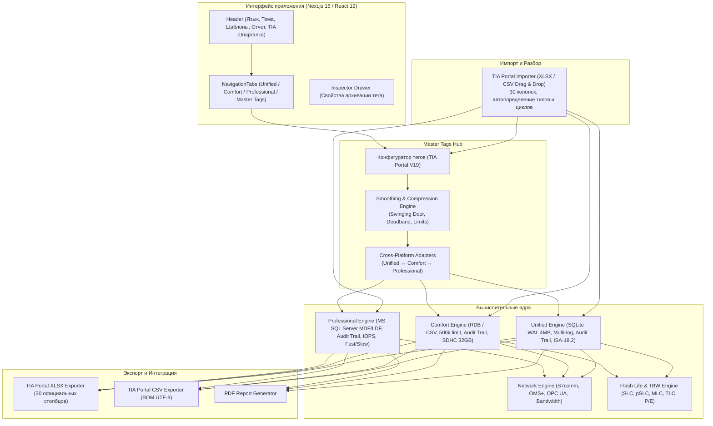

# Siemens WinCC Log & Storage Architect ⚡

<p align="center">
  <b>Комплексный инженерный калькулятор и валидатор хранилищ архивов Siemens TIA Portal V14–V21+ и WinCC V7/V8</b><br>
  WinCC Unified (SQLite / MS SQL) • WinCC Comfort / Advanced (RDB / CSV) • WinCC Professional & WinCC V7/V8 (MS SQL Server)
</p>

<p align="center">
  
  
  
  
  
  
  
  
</p>

---

## 🇷🇺 Описание проекта

**Siemens WinCC Log & Storage Architect** — специализированное веб-приложение и оффлайн PWA-инструмент для инженеров АСУ ТП, проектировщиков и специалистов по ПНР. Калькулятор рассчитывает объемы баз данных, периоды сегментации, кольцевые буферы, сетевой трафик и ресурс флеш-памяти для всех линеек **Siemens SIMATIC WinCC** (TIA Portal V14–V21+ и классических SCADA WinCC V7.0–V8.0):

### 1. WinCC Unified (Unified Comfort Panels MTP & PC Runtime)
* **Мульти-архивная архитектура**: независимое создание и параллельный расчет произвольного количества журналов данных ($N$ Data Logs) и журналов тревог ($M$ Alarm Logs).
* **Индивидуальная параметризация**: каждый архив может иметь собственный срок хранения (`retentionDays`) и период сегмента (`segmentHours`), либо наследовать глобальные настройки проекта.
* **Строгая спецификация Siemens SQLite WAL**:
  - Размер сегмента кратен **4 МБ** и не менее **4 МБ** (`Math.ceil(size / 4) * 4`).
  - Проверка правила **минимум 3 сегментов** в периоде хранения для бесшовной кольцевой ротации без потери архивов.
  - Минимальный кольцевой буфер одного активного журнала — не менее **200 МБ**.
  - Учет коэффициента записи журнала упреждающей записи **SQLite WAL (1.5x Write Amplification)**.
* **Анализ нагрузки по стандарту ISA-18.2 / EEMUA 191 (Advisory)**:
  - Расчет средней интенсивности аварийных событий в час и сутки.
  - Инженерная оценка перегрузки оператора: *Оптимально* (<6 соб/ч), *Умеренная* (6–12 соб/ч), *Высокая* (12–30 соб/ч) и *Перегрузка / Риск лавины алармов Alarm Flood* (>30 соб/ч).
* **Моделирование износа Flash-памяти (TBW / Flash Life)**:
  - Расчет суточного объема перезаписи с учетом ротации полных 4 МБ сегментов и WAL-журналирования.
  - Профили выносливости ячеек: SIMATIC SD Card (2000 P/E циклов), Industrial USB (1000 P/E циклов), Enterprise SSD (600 P/E циклов).
  - Поддержка пользовательских карт памяти SDHC/SDXC для слота данных X52 с рекомендацией классов **High Endurance / Industrial (pSLC/MLC)**.
* **Защита от переполнения (>100%)**: критический аварийный баннер и валидация превышения емкости носителя.
* **Чек-лист пусконаладки накопителей Siemens (SIOS Best Practices)**:
  - Правило 1: строго разметка MBR с 1 основным разделом (GPT не поддерживается).
  - Правило 2: слот X52 поддерживает NTFS (рекомендация Siemens) и FAT32; exFAT не поддерживается.
  - Правило 3: размер кластера 4 КБ или 32 КБ.
  - Правило 4: только латиница (ASCII) в путях и именах архивов (запрет кириллицы, пробелов, спецсимволов).
  - Правило 5: запрет горячего извлечения (Safe Removal / `CloseAllLogs`).
  - Правило 6: аппаратный переключатель Lock и буферное питание 24 В (SITOP UPS500).

### 2. WinCC Comfort / Advanced (Панели TP/KP Comfort и RT Advanced)
* Поддержка проприетарного бинарного формата **RDB** и текстового **CSV**.
* Расчет последовательности файлов журналов (`Sequence of log files`) и объема записей на файл (`Data records per log`).
* Контроль жесткого аппаратного лимита Siemens — **до 500 000 записей на файл**.
* Контроль аппаратного ограничения Comfort Panels (Windows CE 6.0) — **максимум 32 ГБ (FAT32, SDHC)**.
* **Расчет Audit Trail (GMP / 21 CFR Part 11)**: моделирование журнала действий оператора SIMATIC WinCC Audit (~250 байт/запись с криптографическим хэшем), влияние на суточную запись на Flash (`dailyWrittenGb`) и ресурс SD-карты.

### 3. WinCC Professional & WinCC Classic (V7.0 / V7.5 / V8.0 SCADA)
* **100% архитектурная эквивалентность**: математическая модель и расчет базы данных Microsoft SQL Server полностью совпадают для TIA Portal WinCC Professional и автономных систем SIMATIC WinCC V7.0, V7.5, V8.0.
* Автоматическое разделение тегов на **Fast Tag Logging** (цикл опроса $\le 1$ мин, бинарное сжатие ~16 байт) и **Slow Tag Logging** (цикл $> 1$ мин, ~32 байта).
* Расчет первичных файлов баз данных (**MDF**) и журналов транзакций (**LDF**, запас +20–25% на Bulk Insert).
* Контроль порога **10 GB** бесплатной редакции Microsoft SQL Server Express.
* **Архив электронного аудита (Audit Trail)**: моделирование таблицы `AuditLogging` в SQL Server (~500 байт/запись с электронными подписями) с расчетом дисковой нагрузки и требований к **IOPS**.

### 4. Конфигуратор тегов (Master Tags Hub / Инспектор TIA Portal V14–V21+)
* **Прямой импорт таблиц TIA Portal (XLSX / CSV Drag & Drop)**: автоматический парсинг 30-колоночных файлов экспорта TIA Portal V14–V21+, автоопределение имен, адресов в ПЛК (`PLC tag`), типов данных, циклов и комментариев в режимах добавления (`Append`) или замены (`Replace`).
* **Единый кросс-платформенный реестр**: централизованное хранение и взаимная синхронизация тегов между WinCC Unified, Comfort и Professional в один клик.
* **Селектор импорта тегов из рантаймов**: выпадающее меню загрузки тегов из Unified, Comfort или Professional с живыми счетчиками тегов.
* **Продвинутое трендовое сжатие и фильтрация**:
  - **Swinging Door** (качающаяся дверь): сокращение первичного потока записей до 85–90% без потери динамики процесса.
  - **Deadband (Value / Relative)**: абсолютная и относительная зона нечувствительности.
  - **Limit Scope**: фильтрация записи по технологическим уставкам (внутри, вне или по границам диапазона).
  - **On Demand / Trigger Mode**: сбор данных по событиям, дискретному триггеру или изменению статуса.
* **Встроенная матрица совместимости**: мгновенная валидация параметров с рекомендациями и безопасной адаптацией под ограничения целевой платформы.
* **Эргономичный UI**: непрерывный ввод тегов без навязчивого всплывания модалок; инспектор свойств открывается строго по клику на тег.

---

## 🏗️ Архитектура системы



---

## 📊 Инженерные функции и интеграция с TIA Portal

* **Двусторонний обмен с TIA Portal V14–V21+**:
  - **Экспорт в Excel (.xlsx)**: генерация готовой рабочей книги со страницами `Hmi Tags` (30 официальных столбцов TIA Portal) и `Substitute Value Usage` для прямого импорта в HMI Tags.
  - **Экспорт в CSV (.csv)**: выгрузка с разделителем `;` и UTF-8 BOM.
  - **Импорт тегов (.xlsx, .xls, .csv)**: парсинг циклов TIA Portal (`T100ms`, `T250ms`, `T500ms`, `T1s`, `T2s`, `T5s`, `T10s`, `T1min`, `T5min`, `T1d`), автоматическое распознавание типов данных (`Bool`, `Int`, `Real`, `String`), режимов сбора и автоматическая маршрутизация тегов.
* **Оценка сетевой нагрузки Industrial Ethernet**:
  - Расчет полезной нагрузки и накладных расходов протоколов (S7comm, OMS+, OPC UA Binary).
  - Расчет полосы в Кбит/с и Мбит/с, а также загрузки канала **100BASE-TX Fast Ethernet** (0–100%).
  - Прогноз суточного (МБ/сут) и месячного (ГБ/мес) объема трафика.
* **Библиотека отраслевых шаблонов (Industry Presets)**:
  - КНС / Насосная станция
  - Котельная / ИТП
  - Фармацевтика / GMP (Audit Trail по 21 CFR Part 11)
  - Вентиляция и климат (HVAC)
* **Каталог заказных номеров Siemens (MLFB) и спецификация BoM**:
  - Официальные артикулы карт SIMATIC SD (512MB, 2GB, 12GB, 32GB), USB 128GB и SSD для спецификации проекта.
* **Генерация отчета для проектной документации**:
  - Формирование сводного листа расчета с таблицами архивов, спецификацией оборудования и правилами монтажа накопителей с функцией печати в PDF.

---

## 🛠️ Технический стек и архитектура

* **Фреймворк**: Next.js 16.3.4 (App Router & Turbopack)
* **Библиотека UI**: React 19.2.8 (Strict Mode, 0 антипаттернов `useEffect`)
* **Стилизация**: Tailwind CSS 4.3.3 (Siemens Petrol Palette & Dark Mode)
* **Язык**: TypeScript 5.8 (строгая типизация без `any`)
* **Иконки**: Lucide React 1.39.0
* **Работа с таблицами**: SheetJS (`xlsx` 0.20.3 безопасной сборки) + `read-excel-file`
* **Качество кода**:
  - 0 ошибок и предупреждений ESLint (`npm run lint`).
  - 490 автоматизированных тестов математических ядер (`npx tsx scripts/testEngines.ts`).
  - 0 уязвимостей зависимостей (`npm audit`).
* **PWA & Offline**: Web App Manifest + Service Worker с сетевой политикой Network-First.

---

## ⚡ Что нового в версии 2.17.1

* **Плавное переключение темной и светлой темы (CSS View Transitions API)**:
  - Устранены рывки, мерцания и контрастные полосы между карточками при смене темы оформления.
  - Ликвидирован рассинхронизированный CSS-переход у `body`, приводивший к отставанию цвета фона от стеклянных панелей.
  - Внедрен нативный аппаратный кросс-фейд через современный веб-стандарт `document.startViewTransition` с поддержкой директивы доступности `@media (prefers-reduced-motion: reduce)`.
  - Синхронное обновление класса `dark` на теге `<html>` и `localStorage` в момент клика исключает асинхронную задержку `useEffect`.
  - Реализована безопасная деградация (graceful fallback) для старых браузеров (мгновенное четкое переключение без артефактов).
* **Поисковая оптимизация под запросы «WinCC Tag Logging» (SEO & SSR)**:
  - Устранен пустой рендер `<body>` при первой загрузке: поисковые роботы (Googlebot, Bingbot) получают готовый статический HTML (155+ КБ) со всеми таблицами, шапкой и FAQ сразу в первом ответе сервера.
  - Добавлены ключевые фразы `wincc tag logging`, `wincc tag logging archive configuration` в Title, Description, OpenGraph и Twitter Cards.
  - Внедрен развернутый инженерный FAQ по Tag Logging (циклы опроса/архивации, SQLite WAL, лимиты RDB, Fast/Slow теги) с микроразметкой `FAQPage` (JSON-LD).
  - Очищен `sitemap.xml` от параметров запроса для устранения конфликтов канонических ссылок.
* **Испытательный полигон**:
  - Все **499 модульных тестов** калькулятора, парсеров и адаптеров проходят со 100% успехом.

---

## ⚡ Что нового в версии 2.17.0

* **Мгновенное переключение вкладок (0ms Lag & Keep-Alive Архитектура)**:
  - Устранена задержка (200–450 мс) и фризы интерфейса при смене вкладок: внедрен механизм ленивого монтирования `visitedTabs` и переключение видимости через CSS (`block` / `hidden`).
  - Сохраняются позиции скролла, введенные поисковые запросы, фильтры и фокус внутри каждой вкладки.
  - Все корневые вкладки (`UnifiedTab`, `ComfortTab`, `ProfessionalTab`, `MasterTagsTab`), а также `Header` и `NavigationTabs` обернуты в `React.memo`.
  - Переключение активной вкладки переведено в неблокирующий `React.startTransition` для приоритетного отклика UI.
  - Массивный статический блок FAQ & SEO вынесен в автономное изолированное поддерево `SeoFaqSection`, исключающее холостые пересчеты DOM.
  - Фоновые световые пятна (Siemens Petrol/Cyan Blobs) аппаратно изолированы на GPU Compositor (`will-change: transform`) с поддержкой `@media (prefers-reduced-motion: reduce)`.
* **Исправление синхронизации свойств тегов в Конфигураторе тегов**:
  - Устранен баг, при котором изменения параметров в боковой панели свойств не отображались в строке конфигуратора: поиск целевого тега переведен на строгий UUID (`tag.id`) вместо мутирующего индекса.
* **Корректный перенос имени тега в Runtime-вкладки**:
  - При переносе тегов из Конфигуратора в Unified, Comfort и Professional поле имени (`tag.name`) гарантированно сохраняется как первичное имя, исключая подмену развернутым описанием (`tag.description`).
* **Интеллектуальная маршрутизация по нескольким Data Log**:
  - Если в целевой конфигурации создано более одного архива данных (`Data Log`), перед переносом отображается диалог выбора целевого журнала: сопоставление по именам либо групповое размещение в конкретный архив.
* **Испытательный полигон**:
  - **499 модульных тестов** калькулятора, парсеров и адаптеров (100% PASS).

---

## ⚡ Что нового в версии 2.16.0

* **Прямой импорт таблиц экспорта TIA Portal (XLSX / CSV Drag & Drop) в Конфигуратор тегов**:
  - Поддержка перетаскивания и парсинга официальных 30-колоночных файлов `Hmi Tags.xlsx` напрямую в Конфигуратор тегов (Master Tags Hub).
  - Автоматическое распознавание символьных адресов ПЛК (`PLC tag`), соединений, типов данных, циклов опроса и комментариев.
  - Поддержка режимов добавления (`Append`) и полной замены (`Replace`) с предпросмотром структуры строк.
* **Сквозной расчет Audit Trail (GMP / 21 CFR Part 11) для всех платформ**:
  - **WinCC Comfort / Advanced**: моделирование журнала действий оператора SIMATIC WinCC Audit (~250 байт/запись с криптографическим хэшем), динамический пересчет нагрузки на запись Flash (`dailyWrittenGb`) и ресурса SD-карты.
  - **WinCC Professional**: моделирование архивной таблицы `AuditLogging` в SQL Server (~500 байт/запись с электронными подписями) с расчетом прироста размера MDF/LDF и требуемых IOPS дисковой подсистемы.
* **Интеллектуальное выпадающее меню загрузки тегов из рантаймов**:
  - Быстрый импорт тегов из Unified, Comfort или Professional с живыми бейджами счетчиков тегов в каждом источнике.
  - Устранена графическая обрезка выпадающего списка (исправлен overflow контейнера).
* **Расширение испытательного полигона**:
  - **490 модульных тестов** математических ядер и парсеров (100% PASS).

---

## ⚡ Что нового в версии 2.15.2

* **Адаптивная верстка и устранение графических недочетов мобильных экранов**:
  - **Карточки Data Logs & Alarm Logs**: параметры срока хранения и сегментов переведены на адаптивную сетку `grid-cols-1 sm:grid-cols-2`. Выпадающие списки быстрых пресетов (`[ 24ч v ]`) больше не выталкиваются за пределы карточек на смартфонах.
  - **Мобильный тулбар шапки**: исправлен баг обрезки текста («Шпаргалк») за счет применения `whitespace-nowrap` и `min-w-fit`.
  - **Выравнивание контейнеров**: удален лишний горизонтальный отступ `px-3` с корневого `<header>`, благодаря чему сетки шапки и основного контента теперь строго совпадают по левому и правому краю (`px-4 sm:px-6 lg:px-8`).
  - **Инспектор тегов и Comfort**: поля свойств архивов и сигналов защищены от переполнения на узких дисплеях (320–390px).

---

## ⚡ Что нового в версии 2.15.1

* **Глубокая поисковая оптимизация и интеграция с AI-поисковиками (SEO & AI-Search)**:
  - Поддержка стандартов **Open Knowledge Format** (`/llms.txt` и `/llms-full.txt`) для индексации и прямого цитирования в Perplexity, ChatGPT Search и Claude.
  - Генерация динамических векторных карточек **OpenGraph и Twitter Cards (1200×630)** на базе нативного движка Next.js `ImageResponse` (`@vercel/og`).
  - Мульти-схемная семантическая микроразметка **JSON-LD (`@graph`)**: схемы `WebApplication`, `FAQPage` (интерактивный аккордеон в выдаче Google), `HowTo` (методика расчета TIA Portal) и `BreadcrumbList`.
  - Двуязычная связка **`hreflang` alternates** (`ru-RU`, `en-US`, `x-default`) и тег `<meta httpEquiv="content-language">` для совместимости с Microsoft Bing.
  - Расширенные правила `robots.txt` с прямым допуском AI-агентов (`GPTBot`, `PerplexityBot`, `ClaudeBot`, `Applebot`).
  - **Deep Linking**: инициализация и сохранение состояния активных вкладок и языка в URL (`/?tab=...`, `/?lang=...`) без холостых ререндеров.

---

## ⚡ Что нового в версии 2.18.0

* **Выделенная SEO-архитектура посадочных страниц (Next.js App Router)**:
  - Созданы автономные статические маршруты `/unified`, `/comfort`, `/professional`, `/master-tags` с независимыми заголовками, OpenGraph, Twitter Cards и каноническими ссылками.
  - Устранен конфликт каноникализации и hreflang: чистая кросс-языковая адресация без взаимного подавления локалей поисковыми роботами.
  - Обновлен `sitemap.xml` с включением всех целевых маршрутов под узкоспециализированные запросы инженеров.
* **Инженерные формулы и цитируемость в AI-поиске (Princeton GEO AI-SEO)**:
  - Внедрен интерактивный блок математических моделей расчета: сегментация SQLite WAL по 4 МБ, ресурс Flash-памяти в годах (TBW), лимит RDB 500k строк и Fast/Slow теги.
  - Добавлены официальные ссылки на Siemens Industry Online Support (SIOS 109772222, 109746939, 109810540) и стандарты ANSI/ISA-18.2 / IEC 62682.
  - Расширена разметка JSON-LD: спецификатор `isBasedOn`, ссылки на SIOS и метаданные `SoftwareApplication`.
  - Добавлена верификация Bing Webmaster Tools (`msvalidate.01`) для выдачи Microsoft Copilot.
* **Виральная атрибуция и инструменты дистрибуции**:
  - Метаданные `wb.Props` в экспортируемых файлах `Hmi Tags.xlsx` для цитирования инструмента без нарушения 30-колоночной структуры TIA Portal.
  - Ссылка на инструмент в колонтитуле официального верификационного штампа отчета проекта (`ReportModal`).
  - Создан пакет материалов для дистрибуции в профессиональных сообществах (`docs/MARKETING_DISTRIBUTION_KIT.md`: Reddit r/PLC, форум Siemens SIOS, статья для Хабра).

## ⚡ Что нового в версии 2.15.0

* **Конфигуратор тегов (Master Tags Hub / TIA Portal V19 Inspector)**:
  - Централизованный реестр тегов с поддержкой алгоритмов сжатия **Swinging Door** (-85...90%), **Deadband**, фильтрации **Limit Scope** и триггерного режима **On Demand**.
  - Интеллектуальная матрица совместимости и безопасная адаптация тегов для WinCC Comfort и Professional.
  - Эргономичный **Slide-over Drawer** (выдвижная панель свойств архивации справа) с возможностью непрерывного пакетного добавления тегов без навязчивого открытия шторки.
* **Оптимизация производительности (Vercel React Best Practices)**:
  - Мемоизация ядер расчёта (`calculateUnified`, `calculateComfort`, `calculateProfessional`) через `useMemo` с изолированными зависимостями — исключены холостые перерасчёты при внешних событиях.
  - Динамическое разделение кода (`next/dynamic`) для тяжелых модальных окон (Шпаргалка TIA, Отчеты, Отраслевые шаблоны).
  - Плавный поиск без задержек ввода благодаря `useDeferredValue`.
* **Доступность, локализация и UX (Web Interface Guidelines & Taste)**:
  - Атрибуты `aria-label` для экранных дикторов на всех кнопках без текстовых подписей.
  - Полная двуязычная локализация (RU / EN) таблицы конфигуратора тегов, фильтров и бейджей.
  - Стилизованная карточка **Empty State** с быстрыми кнопками действий при пустом списке.
* **Надежность и верификация**:
  - Расширение тестового набора до **461 теста** (100% PASS).
  - 0 ошибок линтинга (`npm run lint`), 0 уязвимостей в зависимостях (`npm audit`).

---

## 🚀 Быстрый запуск

```bash
# 1. Клонирование репозитория
git clone https://github.com/M-Galymzhan/wincc-log-architect.git
cd wincc-log-architect

# 2. Установка зависимостей
npm install

# 3. Запуск тестов математических движков
npx tsx scripts/testEngines.ts

# 4. Запуск локального сервера разработки
npm run dev
```

Откройте браузер по адресу: `http://localhost:3000`

---

## 👤 Автор

* **M-Galymzhan** ([GitHub](https://github.com/M-Galymzhan))
* Email: `galymzhan.manarbekuly@gmail.com`
